# BPAY Payment Integration Flow

**Version:** 1.0  
**Last Updated:** October 31, 2025  
**Status:** Active

## Table of Contents

1. [Overview](#overview)
2. [System Architecture](#system-architecture)
3. [Complete Payment Flow](#complete-payment-flow)
4. [API Endpoints Reference](#api-endpoints-reference)
5. [Data Structures](#data-structures)
6. [Payment Status Transitions](#payment-status-transitions)
7. [Error Handling](#error-handling)
8. [Testing Guide](#testing-guide)
9. [Configuration Requirements](#configuration-requirements)

---

## Overview

This document describes the complete end-to-end payment flow for the e-commerce system using BPAY (Biller Payment System). The integration involves three main components working together to process customer payments securely and reliably.

### Key Participants

- **Frontend (React)** - User interface running on `http://localhost:5173`
- **Store Backend (Spring Boot)** - E-commerce API running on `http://localhost:8081`
- **Bank Service (Spring Boot)** - External banking system running on `http://localhost:8083`

### Payment Method

**BPAY** - An Australian electronic bill payment system that allows customers to pay bills through their bank. In our implementation:
- Customers receive a **Biller Code** and **Reference Number**
- They use these to make payments through the bank interface
- The bank notifies the store when payment is completed via webhook

---

## System Architecture

```
┌─────────────────┐
│   User Browser  │
│   (Frontend)    │
│   Port: 5173    │
└────────┬────────┘
         │ HTTP/REST
         │
┌────────▼────────────────────────────────────────────┐
│          Store Backend Service                      │
│          Port: 8081                                 │
│  ┌──────────────────────────────────────────────┐  │
│  │ OrderController, PaymentController,          │  │
│  │ WebhookController                            │  │
│  └──────────────┬───────────────────────────────┘  │
│                 │                                   │
│  ┌──────────────▼───────────────────────────────┐  │
│  │ OrderService, PaymentService                 │  │
│  └──────────────┬───────────────────────────────┘  │
│                 │                                   │
│  ┌──────────────▼───────────────────────────────┐  │
│  │ BankServiceClient (RestTemplate)            │  │
│  └──────────────┬───────────────────────────────┘  │
└─────────────────┼───────────────────────────────────┘
                  │ HTTP/REST
                  │
┌─────────────────▼───────────────────────────────────┐
│          Bank Service                               │
│          Port: 8083                                 │
│  ┌──────────────────────────────────────────────┐  │
│  │ BpayController, WebhookController           │  │
│  └──────────────┬───────────────────────────────┘  │
│                 │                                   │
│  ┌──────────────▼───────────────────────────────┐  │
│  │ BpayService, WebhookService,                │  │
│  │ TransactionRecordService                    │  │
│  └──────────────┬───────────────────────────────┘  │
│                 │                                   │
│  ┌──────────────▼───────────────────────────────┐  │
│  │ PostgreSQL Database (Port: 5433)            │  │
│  │ - customers, accounts, merchants            │  │
│  │ - transaction_records                       │  │
│  │ - bpay_transaction_information              │  │
│  │ - webhook_registrations                     │  │
│  └──────────────────────────────────────────────┘  │
└─────────────────────────────────────────────────────┘

Webhook Flow:
Bank Service ──[POST /api/webhooks/payment]──> Store Backend
```

---

## Complete Payment Flow

### Sequence Diagram

```mermaid
sequenceDiagram
    participant User as 👤 User (Browser)
    participant Frontend as 🖥️ Frontend<br/>(React:5173)
    participant StoreAPI as 🏪 Store Backend<br/>(Spring:8081)
    participant BankAPI as 🏦 Bank Service<br/>(Spring:8083)
    participant BankDB as 💾 Bank DB<br/>(PostgreSQL:5433)

    rect rgb(230, 240, 255)
        Note over User,BankDB: Phase 1: Order Creation
        User->>Frontend: 1. Place Order (Product, Quantity, Address)
        Frontend->>StoreAPI: 2. POST /api/orders<br/>{userId, productId, quantity, shippingAddress}
        StoreAPI->>StoreAPI: 3. Validate & Reserve Stock
        StoreAPI->>StoreAPI: 4. Create Order (status: pending)
        StoreAPI-->>Frontend: 5. Return Order Details<br/>{orderId, status, totalAmount}
        Frontend-->>User: 6. Show Order Summary
    end

    rect rgb(240, 255, 240)
        Note over User,BankDB: Phase 2: Payment Initiation
        User->>Frontend: 7. Proceed to Payment
        Frontend->>StoreAPI: 8. POST /api/payments<br/>{orderId, method: "BPAY"}
        StoreAPI->>BankAPI: 9. POST /bank/api/bpay<br/>{accountId: 1, orderId: "ORD-123", amount: 149.97}
        BankAPI->>BankDB: 10. Create BPAY Record
        BankDB-->>BankAPI: 11. BPAY Saved (status: pending)
        BankAPI-->>StoreAPI: 12. Return BPAY Details<br/>{billerCode: "93242", referenceNumber: "BP-ORD-123",<br/>amount: 149.97, expiresAt: "2025-11-01T12:00:00"}
        StoreAPI->>StoreAPI: 13. Save Payment (status: pending)
        StoreAPI-->>Frontend: 14. Return Payment Details
        Frontend-->>User: 15. Display BPAY Instructions<br/>Biller Code: 93242<br/>Reference: BP-ORD-123<br/>Amount: $149.97
    end

    rect rgb(255, 245, 230)
        Note over User,BankDB: Phase 3: Customer Payment (Simulated)
        User->>Frontend: 16. Click "Pay Now" (Simulate Bank)
        Frontend->>BankAPI: 17. POST /bank/api/bpay/pay<br/>{referenceId: "BP-ORD-123",<br/>customerId: 2, customerAccountId: 2}
        BankAPI->>BankDB: 18. Find BPAY Record
        BankAPI->>BankAPI: 19. Validate BPAY Status (must be pending)
        BankAPI->>BankDB: 20. Create Transaction Record
        BankAPI->>BankDB: 21. Update Account Balances<br/>Customer: -$149.97<br/>Merchant: +$149.97
        BankAPI->>BankDB: 22. Update BPAY Status (pending → paid)
        BankDB-->>BankAPI: 23. Transaction Complete
        BankAPI-->>Frontend: 24. Return 204 No Content
    end

    rect rgb(255, 240, 245)
        Note over User,BankDB: Phase 4: Webhook Notification
        BankAPI->>BankDB: 25. Fetch Webhook Registration
        BankDB-->>BankAPI: 26. Return Webhook URL
        BankAPI->>StoreAPI: 27. POST /api/webhooks/payment<br/>{type: "BPAY_PAYMENT_COMPLETED",<br/>orderId: "ORD-123", paymentId: "BP-ORD-123",<br/>amount: 149.97, paidAt: "2025-10-31T14:30:00"}
        StoreAPI->>StoreAPI: 28. Update Payment Status<br/>(pending → completed)
        StoreAPI->>StoreAPI: 29. Update Order Status<br/>(pending → processing)
        StoreAPI->>StoreAPI: 30. Trigger Order Fulfillment
        StoreAPI-->>BankAPI: 31. Return 200 OK
    end

    rect rgb(245, 240, 255)
        Note over User,BankDB: Phase 5: User Notification
        Frontend->>StoreAPI: 32. GET /api/orders/{orderId}<br/>(Polling for status update)
        StoreAPI-->>Frontend: 33. Return Updated Order<br/>{status: "processing"}
        Frontend-->>User: 34. Display Success Message<br/>"Payment Confirmed! Order Processing..."
    end
```



### Detailed Step-by-Step Flow

#### Phase 1: Order Creation

1. **User Action**: Customer selects product, quantity, and enters shipping address
2. **Frontend → Store Backend**: `POST /api/orders`
   ```json
   {
     "userId": 1,
     "productId": 5,
     "quantity": 3,
     "shippingAddress": {
       "firstName": "John",
       "lastName": "Doe",
       "addressLine1": "123 Main St",
       "city": "Sydney",
       "postcode": "2000"
     }
   }
   ```
3. **Store Backend**: Validates stock availability with Warehouse service via gRPC
4. **Store Backend**: Creates order with status `pending` and total amount calculated
5. **Store Backend → Frontend**: Returns order details
   ```json
   {
     "orderId": 123,
     "status": "pending",
     "totalAmount": 149.97
   }
   ```

#### Phase 2: Payment Initiation

6. **User Action**: Clicks "Proceed to Payment" and selects BPAY method
7. **Frontend → Store Backend**: `POST /api/payments`
   ```json
   {
     "orderId": 123,
     "method": "BPAY"
   }
   ```
8. **Store Backend → Bank Service**: `POST /bank/api/bpay`
   ```json
   {
     "accountId": 1,
     "orderId": "ORD-123",
     "amount": 149.97
   }
   ```
9. **Bank Service**: 
   - Looks up merchant by `accountId` (finds billerCode: "93242")
   - Generates unique reference: `"BP-ORD-123"`
   - Creates BPAY record with status `pending` and 30-minute expiration
10. **Bank Service → Store Backend**: Returns BPAY details
    ```json
    {
      "billerCode": "93242",
      "referenceNumber": "BP-ORD-123",
      "amount": 149.97,
      "expiresAt": "2025-11-01T12:00:00Z"
    }
    ```
11. **Store Backend**: Saves payment record with BPAY details in `payload` field
12. **Store Backend → Frontend**: Returns payment information
13. **Frontend**: Displays BPAY payment instructions to user

#### Phase 3: Customer Payment (Simulated)

14. **User Action**: In real scenario, customer would pay through their bank. Here, clicks "Pay Now" to simulate
15. **Frontend → Bank Service**: `POST /bank/api/bpay/pay`
    ```json
    {
      "referenceId": "BP-ORD-123",
      "customerId": 2,
      "customerAccountId": 2
    }
    ```
16. **Bank Service Processing**:
    - Finds BPAY record by `referenceId`
    - Validates status is `pending` (not already paid)
    - Looks up merchant by `billerCode`
    - Creates `TransactionRecord` with memo "BPAY payment: BP-ORD-123"
    - Updates customer account balance: `1000.00 - 149.97 = 850.03`
    - Updates merchant account balance: `0.00 + 149.97 = 149.97`
    - Updates BPAY status: `pending → paid`
    - Sets `paidAt` timestamp
17. **Bank Service → Frontend**: Returns `204 No Content` (success)

#### Phase 4: Webhook Notification

18. **Bank Service**:
    - Fetches registered webhook URL from `webhook_registrations` table
    - Constructs webhook payload
    - Sends `POST /api/webhooks/payment` to Store Backend
    ```json
    {
      "type": "BPAY_PAYMENT_COMPLETED",
      "orderId": "ORD-123",
      "paymentId": "BP-ORD-123",
      "amount": 149.97,
      "paidAt": "2025-10-31T14:30:00Z"
    }
    ```
19. **Store Backend Processing**:
    - Finds payment by reference in payload
    - Updates payment status: `pending → completed`
    - Updates order status: `pending → processing`
    - Triggers order fulfillment workflow (warehouse notification, etc.)
20. **Store Backend → Bank Service**: Returns `200 OK`

#### Phase 5: User Notification

21. **Frontend**: Polls `GET /api/orders/{orderId}` every few seconds
22. **Store Backend → Frontend**: Returns updated order with status `processing`
23. **Frontend**: Displays success message to user

---

## API Endpoints Reference

### Store Backend API (Port 8081)

#### 1. Create Order

**Endpoint**: `POST /api/orders`

**Authentication**: Required (JWT Bearer token)

**Request Body**:
```json
{
  "userId": 1,
  "productId": 5,
  "quantity": 3,
  "shippingAddress": {
    "firstName": "John",
    "lastName": "Doe",
    "email": "john@example.com",
    "mobileNumber": "+61412345678",
    "addressLine1": "123 Main St",
    "addressLine2": "Apt 4B",
    "country": "Australia",
    "city": "Sydney",
    "suburb": "CBD",
    "postcode": "2000"
  }
}
```

**Response** (201 Created):
```json
{
  "orderId": 123,
  "status": "pending",
  "totalAmount": 149.97,
  "createdAt": "2025-10-31T14:00:00Z"
}
```

**Error Responses**:
- `400 Bad Request` - Invalid input data
- `401 Unauthorized` - Missing or invalid JWT token
- `403 Forbidden` - User ID mismatch
- `404 Not Found` - Product not found
- `409 Conflict` - Insufficient stock

---

#### 2. Create Payment

**Endpoint**: `POST /api/payments`

**Authentication**: Required (JWT Bearer token)

**Request Body**:
```json
{
  "orderId": 123,
  "method": "BPAY"
}
```

**Response** (201 Created):
```json
{
  "paymentId": 456,
  "status": "pending",
  "bpayDetails": {
    "billerCode": "93242",
    "referenceNumber": "BP-ORD-123",
    "amount": 149.97,
    "expiresAt": "2025-11-01T12:00:00Z"
  }
}
```

**Error Responses**:
- `400 Bad Request` - Invalid order ID or unsupported payment method
- `401 Unauthorized` - Missing or invalid JWT token
- `403 Forbidden` - User doesn't own the order
- `404 Not Found` - Order not found
- `502 Bad Gateway` - Bank service unavailable

---

#### 3. Get BPAY Payment Info

**Endpoint**: `GET /api/payments/{id}`

**Authentication**: Required (JWT Bearer token)

**Response** (200 OK):
```json
{
  "billerCode": "93242",
  "referenceNumber": "BP-ORD-123",
  "amount": 149.97,
  "expiresAt": "2025-11-01T12:00:00Z"
}
```

**Error Responses**:
- `400 Bad Request` - Payment is not BPAY type
- `401 Unauthorized` - Missing or invalid JWT token
- `403 Forbidden` - User doesn't own the payment
- `404 Not Found` - Payment not found

---

#### 4. Payment Webhook (Receive from Bank)

**Endpoint**: `POST /api/webhooks/payment`

**Authentication**: None (public endpoint, should validate signature in production)

**Request Body**:
```json
{
  "type": "BPAY_PAYMENT_COMPLETED",
  "orderId": "ORD-123",
  "paymentId": "BP-ORD-123",
  "amount": 149.97,
  "paidAt": "2025-10-31T14:30:00Z"
}
```

**Response** (200 OK):
```
(Empty body)
```

**Error Responses**:
- `400 Bad Request` - Invalid webhook payload
- `404 Not Found` - Payment not found

---

### Bank Service API (Port 8083)

#### 1. Register Webhook

**Endpoint**: `POST /bank/api/webhooks/register`

**Authentication**: None (called by Store Backend on startup)

**Request Body**:
```json
{
  "event": "PAYMENT_EVENT",
  "callbackUrl": "http://localhost:8081/api/webhooks/payment"
}
```

**Response** (200 OK):
```
(Empty body)
```

**Notes**:
- Stores webhook registration in `webhook_registrations` table
- Updates existing registration if event already registered
- Used by Store Backend on application startup

---

#### 2. Create BPAY Payment

**Endpoint**: `POST /bank/api/bpay`

**Authentication**: None (called by Store Backend)

**Request Body**:
```json
{
  "accountId": 1,
  "orderId": "ORD-123",
  "amount": 149.97
}
```

**Response** (201 Created):
```json
{
  "billerCode": "93242",
  "referenceNumber": "BP-ORD-123",
  "amount": 149.97,
  "expiresAt": "2025-11-01T14:00:00Z"
}
```

**Error Responses**:
- `400 Bad Request` - Duplicate BPAY for same order ID
- `404 Not Found` - Merchant not found for account ID

**Notes**:
- Bank looks up merchant by `accountId` to get `billerCode`
- Generates unique reference ID: `"BP-" + orderId`
- BPAY expires after 30 minutes by default

---

#### 3. Process BPAY Payment

**Endpoint**: `POST /bank/api/bpay/pay`

**Authentication**: None (called by Frontend to simulate payment)

**Request Body**:
```json
{
  "referenceId": "BP-ORD-123",
  "customerId": 2,
  "customerAccountId": 2
}
```

**Response** (204 No Content):
```
(Empty body)
```

**Error Responses**:
- `400 Bad Request` - BPAY already paid or insufficient funds
- `404 Not Found` - BPAY reference not found or merchant not found

**Notes**:
- Validates BPAY status is `pending`
- Creates transaction record
- Updates both customer and merchant account balances
- Sends webhook to Store Backend
- In production, this would be triggered by actual bank payment system

---

## Data Structures

### Store Backend DTOs

#### CreatePaymentRequest
```java
{
  "orderId": Long,          // Required
  "method": String          // "BPAY" only supported currently
}
```

#### CreatePaymentResponse
```java
{
  "paymentId": Long,
  "status": String,         // "pending", "processing", "completed"
  "bpayDetails": {
    "billerCode": String,
    "referenceNumber": String,
    "amount": BigDecimal,
    "expiresAt": LocalDateTime
  }
}
```

#### PaymentWebhookEvent
```java
{
  "type": String,           // "BPAY_PAYMENT_COMPLETED"
  "orderId": String,        // "ORD-123"
  "paymentId": String,      // "BP-ORD-123"
  "amount": BigDecimal,
  "paidAt": LocalDateTime
}
```

---

### Bank Service DTOs

#### BankBpayRequest (from Store)
```java
{
  "accountId": Long,        // Merchant's bank account ID (e.g., 1)
  "orderId": String,        // Order identifier (e.g., "ORD-123")
  "amount": BigDecimal      // Payment amount (e.g., 149.97)
}
```

#### BankBpayResponse (to Store)
```java
{
  "billerCode": String,     // Merchant's biller code (e.g., "93242")
  "referenceNumber": String, // Generated reference (e.g., "BP-ORD-123")
  "amount": BigDecimal,
  "expiresAt": LocalDateTime // 30 minutes from creation
}
```

#### BpayPaymentRequest (from Frontend)
```java
{
  "referenceId": String,    // BPAY reference (e.g., "BP-ORD-123")
  "customerId": Long,       // Paying customer ID (e.g., 2)
  "customerAccountId": Long // Customer's bank account ID (e.g., 2)
}
```

#### PaymentWebhookPayload (to Store)
```java
{
  "type": String,           // "BPAY_PAYMENT_COMPLETED"
  "orderId": String,        // Extracted from reference: "BP-ORD-123" → "ORD-123"
  "paymentId": String,      // Full reference: "BP-ORD-123"
  "amount": BigDecimal,
  "paidAt": LocalDateTime
}
```

---

## Payment Status Transitions

### Status Lifecycle

| Stage | Payment Status | Order Status | BPAY Status | Account Balances |
|-------|---------------|--------------|-------------|------------------|
| **Order Created** | - | `pending` | - | No change |
| **BPAY Generated** | `pending` | `pending` | `pending` | No change |
| **Payment Processed** | `pending` | `pending` | `paid` | Customer: -$149.97<br/>Merchant: +$149.97 |
| **Webhook Received** | `completed` | `processing` | `paid` | No change |
| **Order Fulfilled** | `completed` | `delivered` | `paid` | No change |

### State Diagram

```
┌─────────────┐
│   Order     │
│  Created    │
│ (pending)   │
└──────┬──────┘
       │
       │ User initiates payment
       ▼
┌─────────────┐
│   Payment   │
│  Generated  │
│ (pending)   │
└──────┬──────┘
       │
       │ User pays via bank
       ▼
┌─────────────┐
│  BPAY Paid  │
│  (Bank DB)  │
└──────┬──────┘
       │
       │ Webhook sent
       ▼
┌─────────────┐
│   Payment   │
│  Completed  │
└──────┬──────┘
       │
       │ Order updated
       ▼
┌─────────────┐
│    Order    │
│ Processing  │
└─────────────┘
```

---

## Error Handling

### Common Failure Scenarios

#### 1. Order Not Found
**When**: Creating payment for non-existent order  
**HTTP Status**: `404 Not Found`  
**Response**:
```json
{
  "message": "Order not found",
  "status": 404,
  "timestamp": "2025-10-31T14:00:00Z"
}
```
**Resolution**: Verify order was created successfully before attempting payment

---

#### 2. Insufficient Stock
**When**: Creating order with quantity exceeding available stock  
**HTTP Status**: `409 Conflict`  
**Response**:
```json
{
  "message": "Insufficient stock to fulfill order",
  "status": 409,
  "timestamp": "2025-10-31T14:00:00Z"
}
```
**Resolution**: User should reduce quantity or try different product

---

#### 3. Duplicate BPAY Creation
**When**: Attempting to create BPAY for same order twice  
**HTTP Status**: `400 Bad Request`  
**Response**:
```json
{
  "message": "BPAY already exists for order: ORD-123",
  "status": 400,
  "timestamp": "2025-10-31T14:00:00Z"
}
```
**Resolution**: Retrieve existing BPAY details instead of creating new one

---

#### 4. Bank Service Unavailable
**When**: Bank service is down or unreachable  
**HTTP Status**: `502 Bad Gateway`  
**Response**:
```json
{
  "message": "Failed to communicate with Bank Service",
  "status": 502,
  "timestamp": "2025-10-31T14:00:00Z"
}
```
**Resolution**: Retry after service is restored, or contact support

---

#### 5. Insufficient Funds
**When**: Customer account balance less than payment amount  
**HTTP Status**: `400 Bad Request`  
**Response**:
```json
{
  "message": "Insufficient balance",
  "status": 400,
  "timestamp": "2025-10-31T14:00:00Z"
}
```
**Resolution**: Customer should add funds to account or use different account

---

#### 6. Invalid BPAY Status
**When**: Attempting to pay already-paid BPAY  
**HTTP Status**: `400 Bad Request`  
**Response**:
```json
{
  "message": "BPAY already processed: paid",
  "status": 400,
  "timestamp": "2025-10-31T14:00:00Z"
}
```
**Resolution**: Payment already completed, check order status

---

#### 7. Webhook Delivery Failure
**When**: Bank cannot reach Store webhook endpoint  
**Handling**: 
- Bank logs error but doesn't retry automatically
- Returns success to customer (payment still processed)
- Store should have monitoring to detect missed webhooks
- Manual reconciliation may be needed

**Prevention**:
- Ensure Store Backend is running and accessible
- Monitor webhook endpoint health
- Implement webhook signature validation
- Have retry mechanism for critical failures

---

#### 8. Payment Timeout/Expiration
**When**: BPAY not paid within 30 minutes  
**Handling**:
- BPAY status remains `pending`
- Order can be cancelled by user or system
- New BPAY can be generated if order still valid
- Expired BPAYs should be marked as `expired` by scheduled job

---

## Testing Guide

### Prerequisites

1. **Services Running**:
   - PostgreSQL on port 5433 (database: `bank`)
   - Store Backend on port 8081
   - Bank Service on port 8083
   - Frontend on port 5173 (optional for UI testing)

2. **Database Setup**:
   ```bash
   # Bank database should have seed data:
   # - Customer ID 1: E-Store Business
   # - Account ID 1: E-Store Business Account (balance: 0.00)
   # - Merchant ID 1: Biller Code "93242"
   # - Customer ID 2: John Doe
   # - Account ID 2: John Personal Account (balance: 1000.00)
   ```

3. **Webhook Registration**:
   Store Backend automatically registers webhook on startup

---

### Manual Testing with cURL

#### Step 1: Create User and Login (Store Backend)

```bash
# Register user
curl -X POST http://localhost:8081/api/auth/register \
  -H "Content-Type: application/json" \
  -d '{
    "name": "Test User",
    "email": "test@example.com",
    "password": "password123"
  }'

# Login to get JWT token
curl -X POST http://localhost:8081/api/auth/login \
  -H "Content-Type: application/json" \
  -d '{
    "email": "test@example.com",
    "password": "password123"
  }'

# Save the returned token
export JWT_TOKEN="eyJhbGciOiJIUzI1NiIsInR5cCI6IkpXVCJ9..."
```

---

#### Step 2: Create Order

```bash
curl -X POST http://localhost:8081/api/orders \
  -H "Content-Type: application/json" \
  -H "Authorization: Bearer $JWT_TOKEN" \
  -d '{
    "userId": 1,
    "productId": 1,
    "quantity": 2,
    "shippingAddress": {
      "firstName": "John",
      "lastName": "Doe",
      "email": "john@example.com",
      "mobileNumber": "+61412345678",
      "addressLine1": "123 Main St",
      "city": "Sydney",
      "suburb": "CBD",
      "postcode": "2000",
      "country": "Australia"
    }
  }'

# Expected Response:
# {
#   "orderId": 1,
#   "status": "pending",
#   "totalAmount": 149.97
# }
```

---

#### Step 3: Create Payment (Generate BPAY)

```bash
curl -X POST http://localhost:8081/api/payments \
  -H "Content-Type: application/json" \
  -H "Authorization: Bearer $JWT_TOKEN" \
  -d '{
    "orderId": 1,
    "method": "BPAY"
  }'

# Expected Response:
# {
#   "paymentId": 1,
#   "status": "pending",
#   "bpayDetails": {
#     "billerCode": "93242",
#     "referenceNumber": "BP-ORD-1",
#     "amount": 149.97,
#     "expiresAt": "2025-11-01T14:00:00Z"
#   }
# }
```

---

#### Step 4: Get BPAY Info (Optional Verification)

```bash
curl -X GET http://localhost:8081/api/payments/1 \
  -H "Authorization: Bearer $JWT_TOKEN"

# Expected Response:
# {
#   "billerCode": "93242",
#   "referenceNumber": "BP-ORD-1",
#   "amount": 149.97,
#   "expiresAt": "2025-11-01T14:00:00Z"
# }
```

---

#### Step 5: Simulate Customer Payment

```bash
# This simulates the customer paying through their bank
curl -X POST http://localhost:8083/bank/api/bpay/pay \
  -H "Content-Type: application/json" \
  -d '{
    "referenceId": "BP-ORD-1",
    "customerId": 2,
    "customerAccountId": 2
  }'

# Expected Response: 204 No Content (empty body)
```

---

#### Step 6: Verify Webhook Received (Check Logs)

```bash
# Check Store Backend logs for webhook receipt
# You should see:
# "Received payment webhook: type=BPAY_PAYMENT_COMPLETED, orderId=ORD-1"
# "Payment completed for payment 1"
# "Order status updated to processing for order 1"
```

---

#### Step 7: Verify Order Status Updated

```bash
curl -X GET http://localhost:8081/api/orders/1 \
  -H "Authorization: Bearer $JWT_TOKEN"

# Expected Response:
# {
#   "orderId": 1,
#   "status": "processing",  // Changed from "pending"
#   "totalAmount": 149.97,
#   ...
# }
```

---

#### Step 8: Verify Bank Account Balances

```bash
# Check customer account (should be reduced)
curl -X GET http://localhost:8083/api/customer/2/account/2

# Expected Response:
# {
#   "id": 2,
#   "balance": 850.03,  // 1000.00 - 149.97
#   ...
# }

# Check merchant account (should be increased)
curl -X GET http://localhost:8083/api/customer/1/account/1

# Expected Response:
# {
#   "id": 1,
#   "balance": 149.97,  // 0.00 + 149.97
#   ...
# }
```

---

### Automated Integration Test

Use the provided test script:

```bash
cd /Users/changxinyu/Documents/s2/5348/Project/Tutorial-06-Group-08/bank
./test-integration.sh
```

This script tests:
- Customer and account creation
- Transaction operations (deposit, transfer, withdraw)
- BPAY payment flow
- Webhook registration and notification
- Error handling scenarios

---

## Configuration Requirements

### Store Backend Configuration

**File**: `store-backend/src/main/resources/application.yml`

```yaml
server:
  port: 8081

spring:
  application:
    name: store-backend
  datasource:
    url: jdbc:postgresql://localhost:5432/store
    username: postgres
    password: postgres

# Bank Service Integration
bank:
  service:
    base-url: http://localhost:8083
    account-id: 1  # Store's merchant account ID in bank system
```

---

### Bank Service Configuration

**File**: `bank/src/main/resources/application.yml`

```yaml
server:
  port: 8083

spring:
  application:
    name: bank-service
  profiles:
    active: local
```

**File**: `bank/src/main/resources/application-local.yml`

```yaml
server:
  port: 8083

spring:
  datasource:
    url: jdbc:postgresql://localhost:5433/bank
    username: postgres
    password: postgres
  jpa:
    hibernate:
      ddl-auto: validate
    show-sql: true
  flyway:
    enabled: true
    locations: classpath:db/migration
    baseline-on-migrate: true
```

---

### Docker Compose (Optional)

If using Docker for PostgreSQL:

```yaml
version: '3.8'

services:
  bank-db:
    image: postgres:15
    ports:
      - "5433:5432"
    environment:
      POSTGRES_DB: bank
      POSTGRES_USER: postgres
      POSTGRES_PASSWORD: postgres
    volumes:
      - bank-db-data:/var/lib/postgresql/data

  store-db:
    image: postgres:15
    ports:
      - "5432:5432"
    environment:
      POSTGRES_DB: store
      POSTGRES_USER: postgres
      POSTGRES_PASSWORD: postgres
    volumes:
      - store-db-data:/var/lib/postgresql/data

volumes:
  bank-db-data:
  store-db-data:
```

---

## Troubleshooting

### Common Issues

#### 1. Webhook Not Received

**Symptoms**: Payment completed in bank but order status still `pending`

**Checks**:
- Verify Store Backend is running and accessible
- Check webhook registration: `SELECT * FROM webhook_registrations;` in bank DB
- Check Store Backend logs for incoming webhook requests
- Verify callback URL in registration matches Store Backend URL

**Solution**:
```bash
# Re-register webhook
curl -X POST http://localhost:8083/bank/api/webhooks/register \
  -H "Content-Type: application/json" \
  -d '{
    "event": "PAYMENT_EVENT",
    "callbackUrl": "http://localhost:8081/api/webhooks/payment"
  }'
```

---

#### 2. Duplicate BPAY Error

**Symptoms**: Cannot create payment, error "BPAY already exists"

**Cause**: Attempting to create second payment for same order

**Solution**: Retrieve existing BPAY details instead:
```bash
curl -X GET http://localhost:8081/api/payments/{paymentId} \
  -H "Authorization: Bearer $JWT_TOKEN"
```

---

#### 3. Insufficient Funds

**Symptoms**: Payment fails with "Insufficient balance" error

**Cause**: Customer account balance less than order amount

**Solution**: Add funds to customer account:
```bash
curl -X POST http://localhost:8083/api/customer/2/account/2/transaction_record/deposit \
  -H "Content-Type: application/json" \
  -d '{
    "amount": 500.00
  }'
```

---

## Security Considerations

### Production Recommendations

1. **Webhook Signature Validation**
   - Bank should sign webhook payloads with HMAC
   - Store should verify signature before processing
   - Prevents unauthorized webhook calls

2. **API Authentication**
   - Bank endpoints should require API keys or OAuth tokens
   - Store-to-Bank calls should include authentication headers
   - Rate limiting on public endpoints

3. **HTTPS Only**
   - All services should use TLS in production
   - Webhook URLs must be HTTPS
   - Certificate validation required

4. **Payment Idempotency**
   - Use idempotency keys for payment processing
   - Prevents duplicate charges on retry
   - Store idempotency keys in database

5. **Audit Logging**
   - Log all payment state changes
   - Include timestamps, user IDs, amounts
   - Retain logs for compliance (7+ years)

6. **PCI Compliance**
   - Never store card details (BPAY reference only)
   - Encrypt sensitive data at rest
   - Limit access to payment data

---

## Appendix

### Related Documentation

- [External Bank System Implementation Plan](./External_Bank_System_Implementation_Plan.md)
- [System Architecture](../docs/SYSTEM_ARCHITECTURE.md)
- [ERD Design](../docs/ERD.md)

### Contact

For questions or issues with payment integration:
- Technical Lead: [Contact Information]
- Documentation: [Repository URL]
- Support: [Support Channel]

---

**Document Version**: 1.0  
**Last Updated**: October 31, 2025  
**Next Review**: January 31, 2026

